# Myra Starter Kit

A production-ready **Laravel 12 + Inertia.js + Vue 3** admin dashboard starter kit with a Filament-style code generator, role-based access control, per-user data isolation, a built-in CMS, an AI writing assistant, and 55+ UI components — so you can ship admin panels with very little hand-written code.


[](https://github.com/spideyrex/myra-starter-kit/actions/workflows/tests.yml)


<p align="center">
  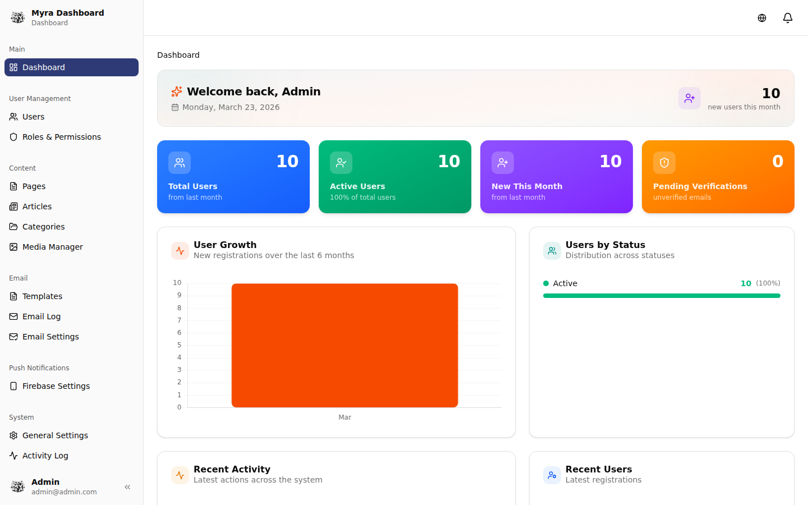
</p>

---

## What's New

Everything below shipped after v2.0.0. Every subsystem marked **opt-in** is **off by default** —
deploying the code changes nothing until you set its flag.

### v2.5.1 — latest
Runtime dependency fix: `fakerphp/faker` moved from `require-dev` to `require`. App code calls
`fake()` in 24 places, and production deploys with `--no-dev`, so two demo pages had been returning
500 since v2.2.0. A guard test now fails CI if runtime code calls into a dev-only package.
Also: `ESCAPE` handling under MySQL `NO_BACKSLASH_ESCAPES`, and inline-upload URLs no longer
double the `inline` path segment.

### v2.5.0 — Dashboards, realtime, gallery, AI
| | |
|---|---|
| **Dashboard editor** | Drag-and-drop tiles, per-user saved layouts, widget catalogue, keyboard reordering |
| **Realtime widgets** *(opt-in)* | Live refresh over Echo on a shared bus — one subscription, not one per widget |
| **Component gallery** | Searchable catalogue with a live props playground and copy-paste snippets |
| **Command palette** | Mounted globally across every admin surface |
| **AI ask bar** *(opt-in)* | Plain-language filters compiled to a **validated rule tree** — never to SQL |
| **PWA shell** *(opt-in)* | Installable offline shell; caches static assets only, never your data |
| **Loading states** | Skeleton/streaming states as the default for data surfaces |

<p align="center">
  
  <br><em>Dashboard editor — drag tiles, save a personal layout, add widgets from the catalogue</em>
</p>

<p align="center">
  
  <br><em>Component gallery with a live props playground</em>
</p>

### v2.4.0 — Extension, structure, tenancy, scale
- **Plugin system** — packages that register pages, resources, widgets, permissions and nav.
  A plugin that fails to load is quarantined, never fatal.
- **Clusters** + nested and singular resources, with server-contributed navigation.
- **Multi-tenancy** *(opt-in, `MYRA_TENANCY`)* — full tenant scoping on the teams tables.
- **Testing helpers** — `InteractsWithMyra`, `TableProbe`, `SchemaProbe`, `ActionProbe`.
- **100k+ rows** — virtualised rendering, cursor pagination, sort-index guard.
- Generators: 8 → **13**.

<p align="center">
  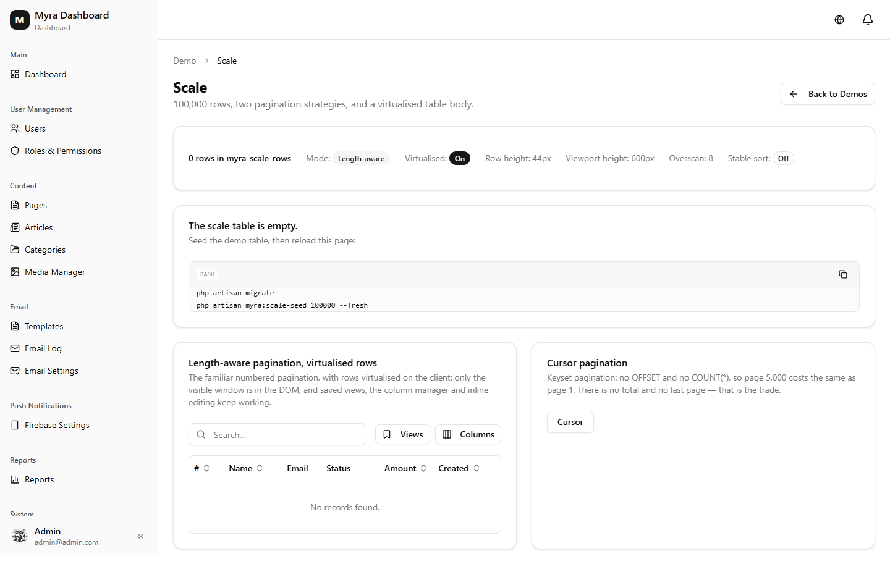
  <br><em>Virtualised rows and cursor pagination</em>
</p>

### v2.3.0 — Reporting, graphs & charts
- **Report builder** — composable definitions (source, dimensions, measures, filters) with **all
  aggregation in SQL**, never in PHP or the browser.
- **15 chart types** — bar/stacked/horizontal, line, area, pie, doughnut, radar, scatter, polar,
  plus heatmap, funnel, gauge and sparkline as inline SVG.
- **Drill-down** from a chart segment into the filtered table, and **cross-filtering** between widgets.
- **Scheduled reports** (cron → render → email) and **PDF export** — no new composer dependency.
- **Comparison periods** on stat and chart widgets.

<p align="center">
  
  <br><em>Report builder with drill-down and comparison periods</em>
</p>

### v2.2.0 / v2.2.1 — Table power features
- **Saved views** — named filter + column + sort presets, per user, shareable.
- **Column manager** with presets and persistence.
- **Streaming export** that never buffers the full result set; **resumable import** with column
  auto-mapping, validation preview and a partial-failure report.
- **Nested AND/OR query builder** with server-side column and operator whitelisting.
- **Ranked global search**, scoped per resource.
- **Security (v2.2.1)** — six unescaped `LIKE` call sites migrated to `Sql::whereLike()`; a `%` in a
  search box no longer matches every row. Relation sort columns are whitelisted.

<p align="center">
  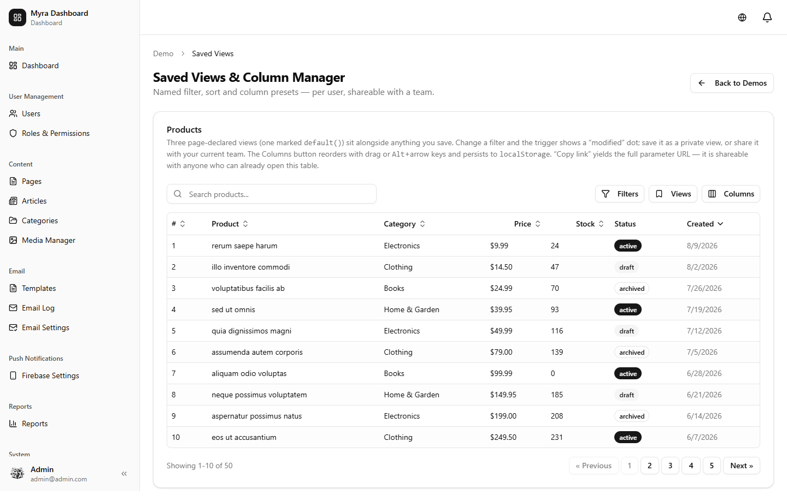
  <br><em>Saved views and the column manager</em>
</p>

### v2.1.0 — Filament v5 parity
- Form fields: **code** (lazy CodeMirror 6), **markdown**, toggle-buttons, and `hint()` / `hintAction()`
  across every field type.
- Table columns: **color**, **checkbox** (inline edit), and summaries extended with min/max/median/range.
- Infolist: **color** and **code** entries.
- Actions: **replicate**, **restore**, **force-delete**, and **action grouping** with nested submenus.

### Quality across the line
| | v2.0.0 | v2.5.1 |
|---|---|---|
| PHP tests | 150 | **688** |
| JS tests (vitest) | none | **541** |
| Generators | 8 | **13** |
| RBAC modules | 17 | **19** |

---

## Table of Contents

- [What's New](#whats-new)
- [Highlights](#highlights)
- [Screenshots](#screenshots)
- [Scaffolding CLI](#scaffolding-cli)
- [Security & Access Control](#security--access-control)
- [Features](#features)
- [Tech Stack](#tech-stack)
- [Requirements](#requirements)
- [Installation](#installation)
- [Default Roles](#default-roles)
- [AI Assistant](#ai-assistant)
- [Internationalization](#internationalization)
- [Theme System](#theme-system)
- [Project Structure](#project-structure)
- [Key URLs](#key-urls)
- [Documentation](#documentation)
- [License](#license)

---

## Highlights

- 🛠️ **Filament-style generators** — scaffold pages, full CRUD resources, or pages cloned from any of 18 feature demos, with routes, sidebar nav, and permissions auto-wired.
- 🔐 **Shield RBAC** — convention-based `{module}.{ability}` permissions synced from config, with a super-admin bypass and an editable permission matrix.
- 👤 **Per-user data isolation** — non-super-admins see only their own records; super-admins see everything.
- 📝 **CMS** — articles, pages, and categories with a Tiptap editor, server-side HTML sanitization, draft/publish workflow, and public blog.
- 🤖 **AI assistant** — bring-your-own-key writing assistant (OpenAI, Anthropic, OpenRouter, or self-hosted Ollama) streamed into the rich text editor.
- 🧱 **Schema-driven forms & tables** — declarative builders with 20+ field types, inline editing, filters, grouping, and reordering.
- 🌍 **i18n**, 🎨 **10 theme presets + dark mode**, 🔔 **in-app + Firebase push notifications**, and **two-factor auth enforced after login**.

---

## Screenshots

| Dashboard (light) | Dashboard (dark) |
|---|---|
|  | 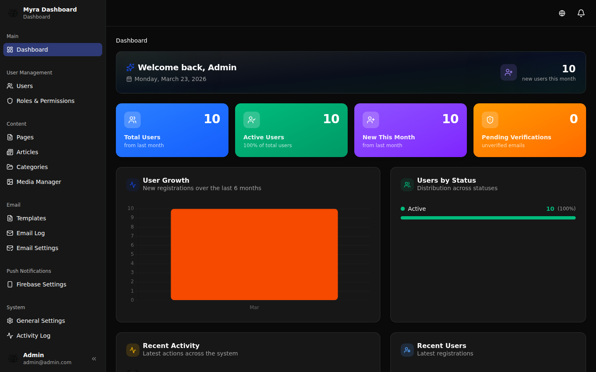 |

| User management | Roles & permission matrix |
|---|---|
| 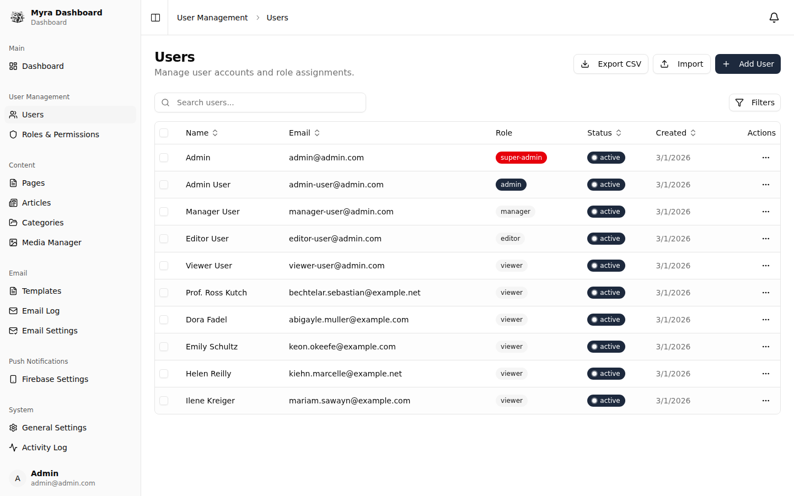 | 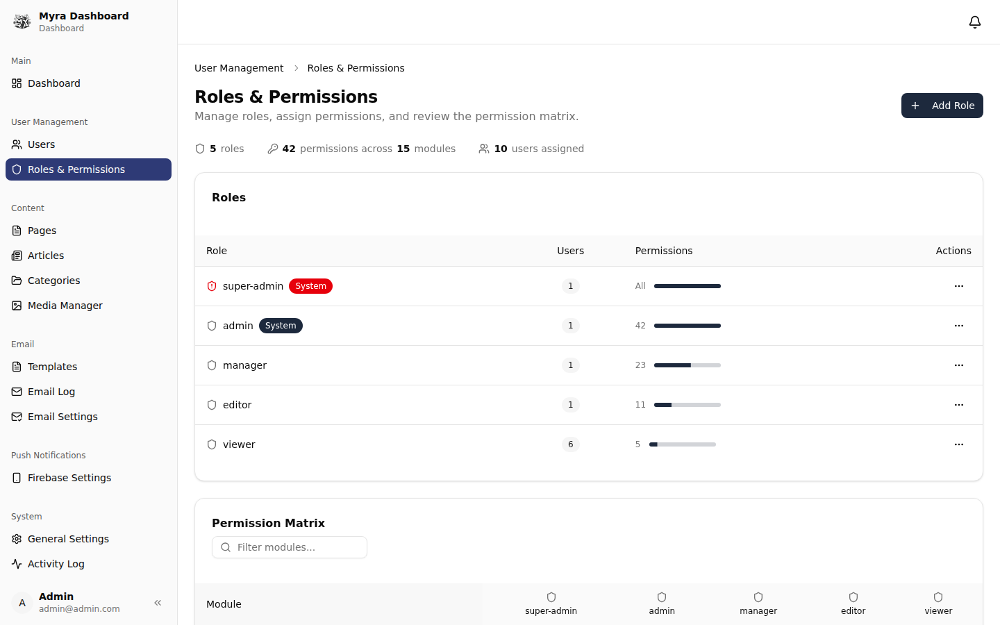 |

| Articles (CMS) | Media manager |
|---|---|
| 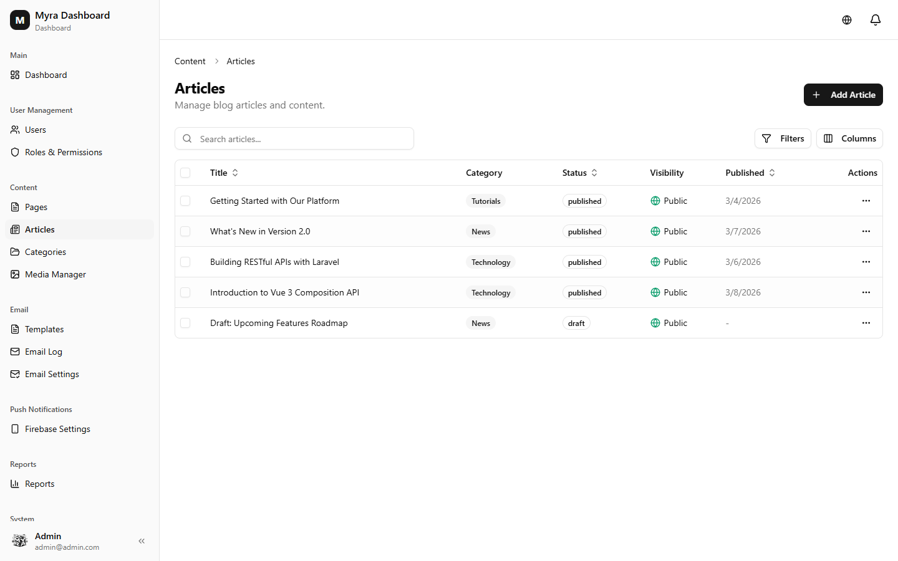 | 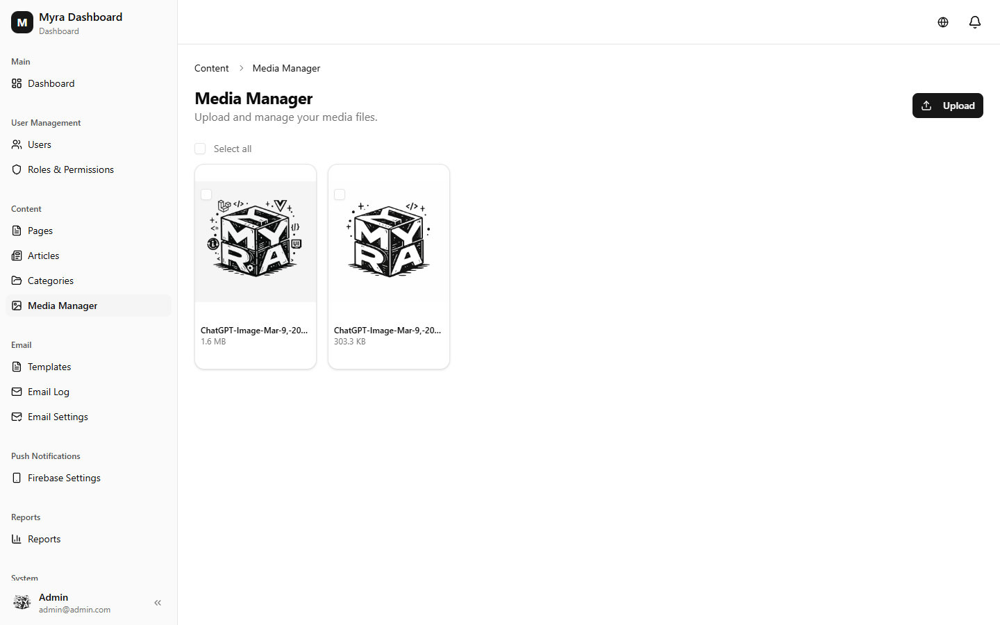 |

| Appearance / theme settings | AI settings |
|---|---|
| 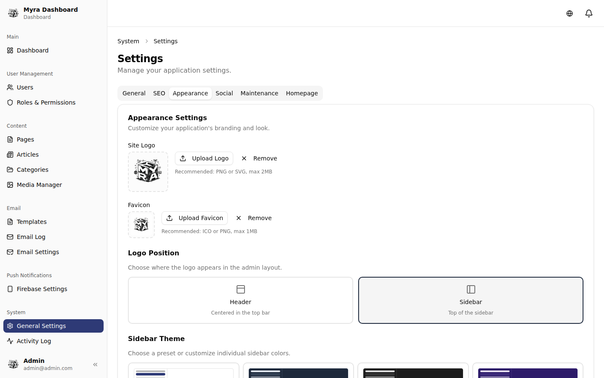 | 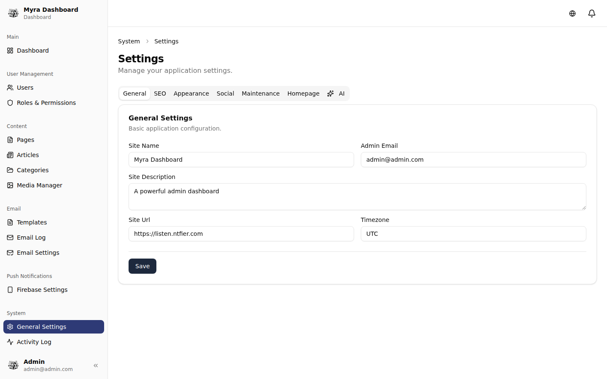 |

| Security (2FA & sessions) | Public homepage |
|---|---|
| 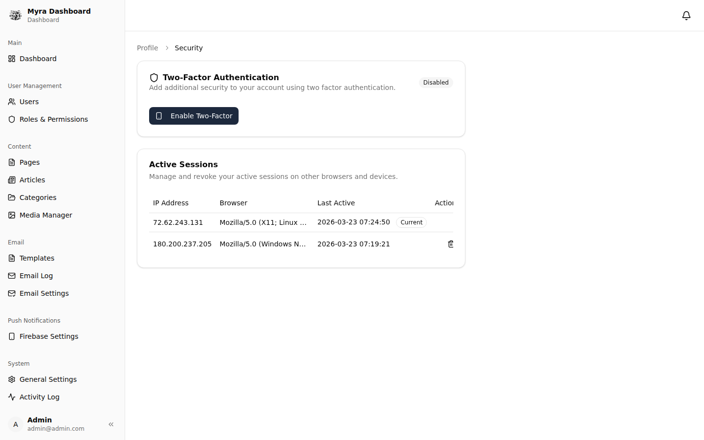 | 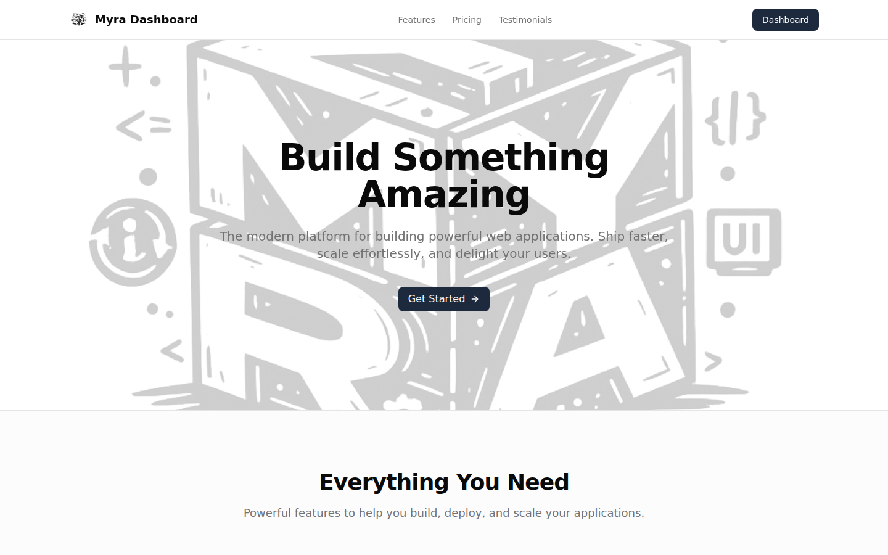 |

| Feature demos | Form builder demo |
|---|---|
| 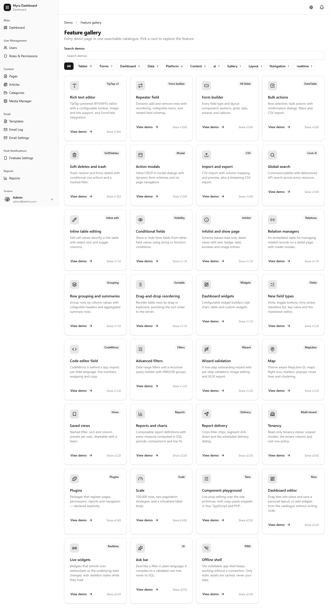 | 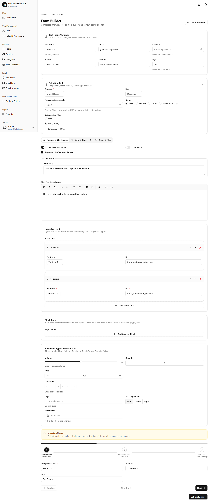 |

> 50+ full screenshots (every module + all 18 demos) live in [`public/docs/screenshots/`](public/docs/screenshots) and the bundled documentation.

---

## Scaffolding CLI

Generate admin modules from the terminal — routes, sidebar nav, and Spatie permissions are **wired automatically** (idempotent markers; pass `--print` to emit snippets instead of editing files).

```bash
# Single page (controller + Vue page) + view permission + route + nav
php artisan make:myra-page Analytics

# Full CRUD resource (controller, service, 3 Vue pages) + 4 permissions + 6 routes
php artisan make:myra-resource Product --model

# Clone any Feature Demo into a runnable page — e.g. a Student page from the form builder
php artisan make:myra-component Student form-builder
```

**Component keywords** (clone the matching demo): `form-builder`, `rich-text-editor`, `repeater-field`, `conditional-fields`, `wizard`, `field-types`, `global-search`, `data-table`, `bulk-actions`, `advanced-filters`, `inline-editing`, `grouping`, `import-export`, `action-modals`, `soft-deletes`, `infolist`, `relation-manager`, `widgets`, `reordering`.

Newly generated permissions appear in the **Roles** matrix immediately, so a super-admin can grant a new page to any role with one click.

Other commands:

```bash
php artisan app:install        # migrations, seeders, shield:generate, interactive admin
php artisan shield:generate    # sync {module}.{ability} permissions from config/shield.php
php artisan content:sanitize   # backfill-sanitize existing stored HTML (--dry-run to preview)
```

---

## Security & Access Control

- **Two-factor authentication enforced after login** — 2FA users must pass the TOTP/recovery challenge before reaching any protected route (middleware-gated, throttled).
- **Account state enforcement** — suspended/pending users cannot log in and are logged out mid-session.
- **Shield RBAC** — permissions declared in `config/shield.php`; super-admin bypasses all checks via `Gate::before`.
- **Role assignment guards** — only super-admins can assign `admin`/`super-admin`; disabled roles are unassignable; the same rules apply to CSV import.
- **Role protections** — super-admins/admins are hidden from lower roles, admins can't manage other admins, and roles have super-admin-controlled `active`/`visible` toggles.
- **Per-user data isolation** — `OwnedByUser` global scope on content models; media scoped to the uploader; public pages explicitly exempt.
- **Hardening** — server-side HTML sanitization (defense-in-depth with client DOMPurify), SVG uploads blocked, CSV formula-injection escaping, whitelisted sort columns + capped pagination, Content-Security-Policy + HSTS in production, and a production-safe seeder.
- **Editable login tagline + server-enforced sign-up toggle.**

---

## Features

### Core
- **User Management** — CRUD, soft deletes, status management, role assignment, impersonation, bulk actions, CSV export
- **Roles & Permissions** — Spatie RBAC with permission matrix, role cloning, active/visible toggles, grouped permissions
- **Dashboard** — stats, user-growth charts, activity feed, role/status breakdowns, configurable widgets
- **Activity Log** — full audit trail with CSV export
- **Media Manager** — uploads via Spatie Media Library, scoped per uploader
- **System Health** — database, cache, disk, and environment checks
- **Backups** — on-demand DB + file backups (Spatie Backup)
- **API Tokens** — Laravel Sanctum token creation/revocation

### Content
- **Articles, Pages, Categories** — Tiptap rich text, featured images, SEO meta, draft → published → archived workflow, public blog at `/blog`
- **Homepage Builder** — configurable hero, features, testimonials, pricing, CTA, navbar, and footer

### Communication
- **Email Templates** — database-driven with variable substitution + test sends
- **Email Log** — audit trail with export
- **Push Notifications** — Firebase Cloud Messaging (web push)
- **In-App Notifications** — real-time bell with read/unread tracking and per-user preferences

### Developer Experience
- **Scaffolding CLI**, **Command Palette** (`Cmd/Ctrl+K`), **20+ interactive feature demos**, full **TypeScript** coverage, **XLSX/CSV export**, **image editor**, and schema-driven **form/table/infolist/widget builders**

---

## Tech Stack

| Layer | Technology |
|-------|-----------|
| **Backend** | Laravel 12, PHP 8.4 |
| **Frontend** | Vue 3.5 (TypeScript), Inertia.js 2 |
| **Styling** | Tailwind CSS 4.2 (oklch) |
| **UI** | shadcn-vue, Reka UI, Lucide icons |
| **Tables** | TanStack Vue Table |
| **Rich Text** | Tiptap |
| **Charts** | Chart.js via vue-chartjs |
| **Maps** | MapLibre GL (shadcn-vue wrappers) |
| **Forms** | Vee-Validate + Zod |
| **Auth / RBAC** | Sanctum, Google2FA, Spatie Permission |
| **Media / Settings / Backups / Health / Activity** | Spatie packages |
| **AI** | OpenAI · Anthropic · OpenRouter · Ollama |
| **Push / Real-time** | Firebase Cloud Messaging (Kreait), Laravel Echo + Pusher |
| **i18n** | vue-i18n (en, ms, zh) |
| **Build** | Vite 7 |

---

## Requirements

- PHP 8.4+
- Node.js 18+
- MySQL / PostgreSQL / SQLite
- Composer 2+

---

## Installation

Clone the repository and install dependencies — everything needed is committed, so it installs with no private access or tokens:

```bash
# 1. Get the code
git clone https://github.com/spideyrex/myra-starter-kit.git my-app
cd my-app

# 2. PHP + JS dependencies
composer install
npm install

# 3. Environment
cp .env.example .env
php artisan key:generate

# 4. Configure your database in .env (MySQL/PostgreSQL/SQLite), then run setup
#    (migrations + seeders + shield:generate + interactive admin account)
php artisan app:install

# 5. Run it (Laravel server + Vite dev server + queue worker + log viewer)
composer dev
```

Visit `http://localhost:8000` and sign in with the admin account you created in step 4.

> **Quickest start (SQLite, zero DB config):** set `DB_CONNECTION=sqlite` in `.env`, run `touch database/database.sqlite`, then `php artisan app:install`.

For production, build assets instead of `composer dev`: `npm run build`, and set `APP_ENV=production`, `APP_DEBUG=false`, `SESSION_ENCRYPT=true`, `SESSION_SECURE_COOKIE=true` in `.env`.

---

## Default Roles

The seeder creates five roles:

| Role | Access |
|------|--------|
| **super-admin** | Full access (bypasses all checks via `Gate::before`) |
| **admin** | All permissions |
| **manager** | Users, content, email, media, notifications (no system settings) |
| **editor** | Content + media (create/edit) |
| **viewer** | Read-only |

44 permissions across 17 modules are grouped by prefix (`users`, `roles`, `pages`, `articles`, …) in the permission matrix. Generated modules add their own automatically.

---

## AI Assistant

Configure a provider under **Settings → AI** (master toggle, provider, API key, model, base URL, temperature, max tokens):

| Provider | Default model | Notes |
|----------|---------------|-------|
| OpenAI (default) | `gpt-4o-mini` | custom base URL supported |
| Anthropic | `claude-sonnet-4-5` | |
| OpenRouter | `openai/gpt-4o-mini` | any listed model |
| Ollama | `llama3.1` | self-hosted, no key |

The rich text editor gains a **Sparkles** menu: generate, improve, fix grammar, shorten, lengthen, summarize, and change tone — streamed via Server-Sent Events.

---

## Internationalization

`vue-i18n` with lazy-loaded locales (`en`, `ms`, `zh`) and a header language switcher. Add a locale by dropping a JSON file in `resources/js/i18n/locales/` and registering it in `resources/js/i18n/index.ts`.

---

## Theme System

10 shadcn color presets (Zinc, Slate, Stone, Red, Rose, Orange, Green, Blue, Violet, Yellow) selectable from **Settings → Appearance**, plus custom sidebar colors, logo/favicon upload, dark mode, and per-mode oklch values applied at runtime across admin and public pages.

---

## Project Structure

```
app/
├── Admin/Traits/            # SearchableQuery, ExportableQuery, HasSampleData
├── Console/Commands/        # app:install, shield:generate, content:sanitize, Myra/ generators
├── Http/
│   ├── Controllers/Admin/   # admin controllers
│   ├── Controllers/Auth/    # authentication
│   └── Middleware/           # Shield, 2FA, active-user, registration, security headers
├── Models/                  # Eloquent models (+ Traits/OwnedByUser)
├── Services/                # business logic (incl. Services/Ai)
├── Settings/                # Spatie settings classes
└── Support/                 # HtmlSanitizer, Csv

config/                      # shield.php (RBAC map), myra.php (generator registry)
resources/js/
├── Pages/Admin/             # admin modules + Demo/ (18 feature demos)
├── Pages/{Auth,Public,Errors}/
├── components/ui/           # 55+ shadcn-vue components
├── composables/             # form/table/infolist/widget builders + helpers
└── i18n/locales/            # en, ms, zh
database/migrations · seeders
stubs/admin/                 # generator templates
```

---

## Key URLs

| URL | Description |
|-----|-------------|
| `/` | Public homepage |
| `/blog`, `/blog/{slug}` | Public articles |
| `/pages/{slug}` | Public static pages |
| `/login`, `/register` | Auth |
| `/dashboard` | Admin dashboard |
| `/admin/users`, `/admin/roles` | User & role management |
| `/admin/articles`, `/admin/pages`, `/admin/categories`, `/admin/media` | CMS & media |
| `/admin/settings` | General, SEO, Appearance, Social, Maintenance, Homepage, AI |
| `/admin/email-templates`, `/admin/email-logs`, `/admin/email-settings` | Email |
| `/admin/firebase-settings`, `/admin/notifications` | Push & notifications |
| `/admin/activity-logs`, `/admin/backups`, `/admin/system-health`, `/admin/api-tokens` | System |
| `/admin/demo` | Feature demos |
| `/docs` | Full documentation |

---

## Documentation

Comprehensive docs ship with the project at [`public/docs/index.html`](public/docs/index.html) (served at `/docs`): the form/table builders, every artisan command, RBAC/Shield, data isolation, role protections, the notification system, and all admin modules — with screenshots throughout.

---

## License

MIT License. See [LICENSE](LICENSE) for details.
