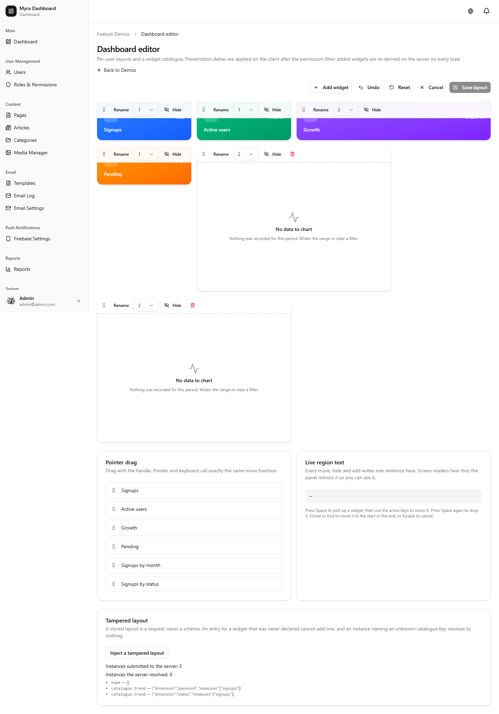
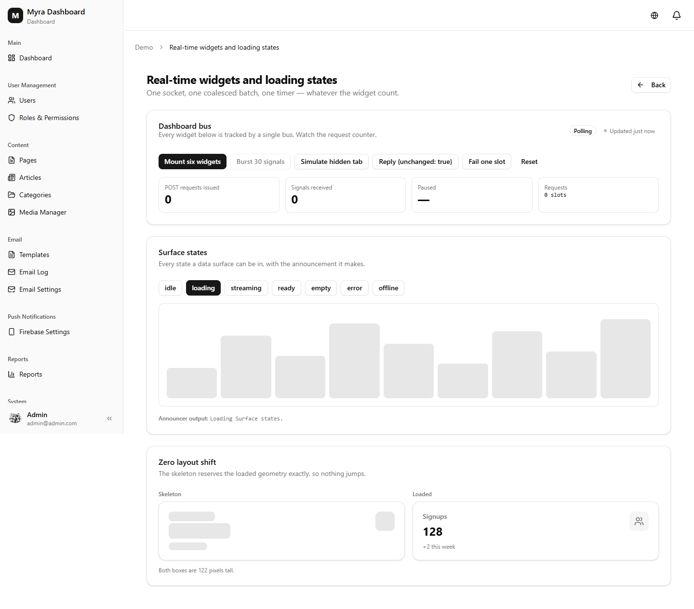
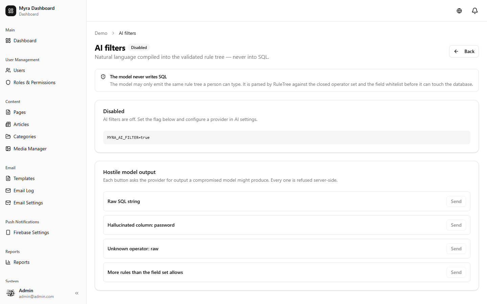
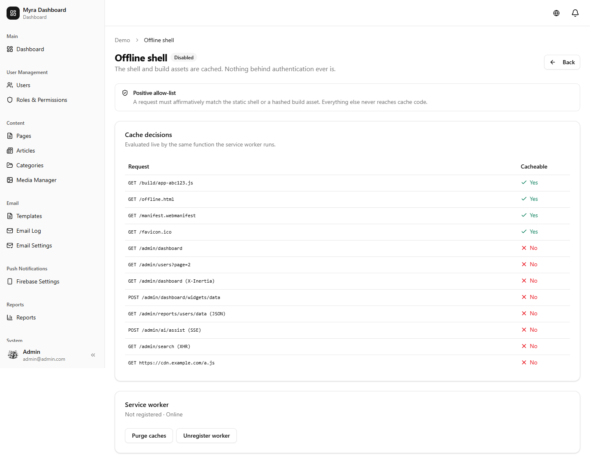
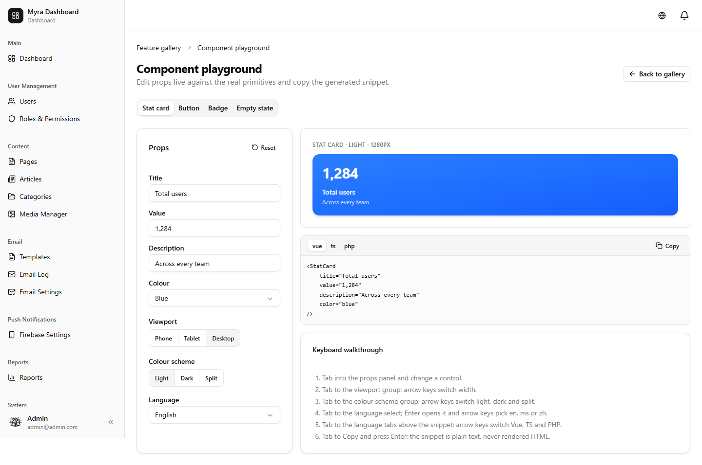

# Dashboard, Realtime, AI & PWA

Shipped in **v2.5.0**. Every subsystem on this page except the dashboard editor is **opt-in and off
by default** — deploying the code changes nothing until you set its flag.

| Subsystem | Flag | Default |
|---|---|---|
| Dashboard editor | — | on |
| Role dashboards | — | inert until an admin configures one |
| Realtime widgets | `MYRA_REALTIME` | **off** |
| AI filter / schema / summarise | `MYRA_AI_FILTER`, `MYRA_AI_SCHEMA`, `MYRA_AI_SUMMARISE` | **off** |
| PWA shell | `MYRA_PWA` | **off** |

---

## Dashboard editor



Drag tiles into place and save a per-user layout; add widgets from the catalogue without writing
code. Layouts persist to `dashboard_layouts`, keyed by user and dashboard.

Reordering is keyboard accessible. `DashboardGrid` emits an **ordered key sequence**, not a
positional index — a grid-local index is ambiguous once a dashboard has more than one grid.

```ts
const { layout, reorderWithin, save } = useDashboardLayout('main');
```

## Role dashboards

Added in **v2.7.0**. Every role can carry a default dashboard. A user of that role gets it
automatically, may personalise it, and can reset back to the role default at any time.

**Inert by default.** With no rows in `role_dashboards` the resolution chain returns nothing and the
dashboard renders exactly as it did before. There is no feature flag because there is nothing to
flag off.

### Precedence

| Rung | When it applies | Reset control |
|---|---|---|
| Personal layout | The user has a row in `dashboard_layouts` | Shown — "Reset to {role} default" |
| Role default | No personal row, and a role they hold has one | Hidden — there is nothing to reset |
| Nothing | Neither exists | Hidden — today's dashboard, byte for byte |

A personal layout wins unconditionally, **including one where every widget is hidden**. "I want an
empty dashboard" is a deliberate personalisation, not an unset value.

Resetting is not a new endpoint. Deleting the personal row is what makes the role default apply
again on the very next request.

### Several roles

Roles carry an admin-orderable `priority` (higher wins, ties broken by `roles.id` ascending). A user
holding several roles gets the dashboard of their **highest-priority role that has one** — a role
without a dashboard is invisible to the ordering, so a user is never blanked by their top role's
silence. Nothing is merged.

Deactivating a role, deleting it, or unassigning it takes effect on the next request; nothing in the
chain is cached. A personal layout survives all three, because it carries no role provenance.

### The security rule

A role dashboard is authored by one person and rendered for another, so **the stored payload is
untrusted input at render time**.

- Every widget instance is re-derived against the **viewing** user's abilities on every render. An
  admin who drops a revenue widget into the `viewer` dashboard produces exactly zero instances for a
  viewer.
- Entries are filtered the same way, so a widget key the viewer may not see never reaches their
  browser.

Authoring is gated by its own ability, `dashboard.manage-roles` — deliberately **not**
`dashboard.customise`, which is the broadly-granted personal-preference ability.

### Starter dashboards

Sensible opening arrangements ship for the five built-in roles, but are **never seeded
automatically** — an upgrade must not rearrange a live deployment's dashboards.

```bash
php artisan myra:role-dashboards:seed
```

Idempotent: an existing role dashboard is never overwritten, so re-running never stomps an admin's
authoring. Every starter is shape-checked and resolved against that role's own permission set before
it is written; a starter naming something the role cannot see fails loudly.

Starters are **entries-only** — order, column span and `hidden` over the six widgets the dashboard
page already declares. `config('myra.dashboard.catalogue')` ships empty, so an instance-based starter
would resolve to nothing on a stock install, and an entries-only payload cannot leak anything.

**Hiding in a starter is tidying, not access control.** Every hidden widget is something that role
could already see; nothing in a starter resurrects or grants anything.

## Realtime widgets



Widgets refresh over the already-wired Laravel Echo connection. A dashboard of N live widgets uses
**one** subscription through a shared bus, not N.

Server side, a model touch emits a signal that is **queued**, never fanned out inside the request:

```php
use App\Admin\Realtime\Concerns\TouchesWidgets;

class Order extends Model
{
    use TouchesWidgets;   // queues EmitWidgetSignal on save
}
```

## Loading states

`DataSurface` plus the skeleton components are the default for any data surface, so a slow query
shows structure rather than a spinner.

```vue
<DataSurface :loading="loading" :error="error">
    <template #skeleton><SkeletonTable :rows="10" /></template>
    <DataTable ... />
</DataSurface>
```

## AI ask bar



Describe a filter in plain language and it is compiled into the **existing validated
`App\Admin\QueryBuilder` rule tree**, then re-validated server-side exactly like a hand-built one.

**The model never produces SQL.** It emits a JSON envelope of column/operator/value triples; every
column is checked against `FieldSpec`'s whitelist and every operator against the closed `Operator`
enum before anything reaches the database. Model output is treated as hostile input.

Other guarantees:

- Provider API keys are read server-side only and never reach the client or an Inertia prop.
- AI endpoints are permission-gated and rate-limited.
- Anything summarised is already ownership-scoped for the acting user — no cross-user leakage.

## PWA shell



An installable app shell that keeps working without a connection.

**The service worker caches only the static shell and build assets.** No admin JSON, no Inertia
response, no user data ever enters the cache — otherwise the next person on a shared browser could
read the previous user's data.

## Component gallery & command palette



The gallery is a searchable catalogue of every demo surface with a live props playground and
copy-paste snippets. A server-side `DemoRegistry` keeps the gallery and the pages in
`resources/js/Pages/Admin/Demo/` from drifting apart — a page without an entry, or an entry without
a page, fails the test suite.

The command palette is mounted globally across every admin surface.

---

## Related

- [Reporting](reporting.md) — the report widgets a dashboard displays
- [Tenancy](tenancy.md) — tenant scoping, also opt-in
