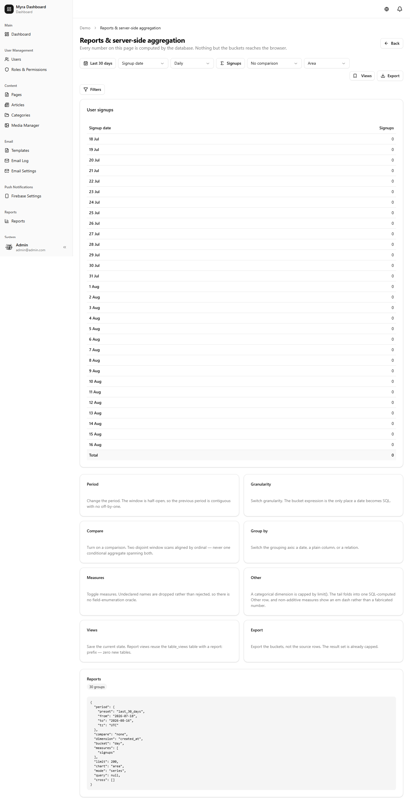
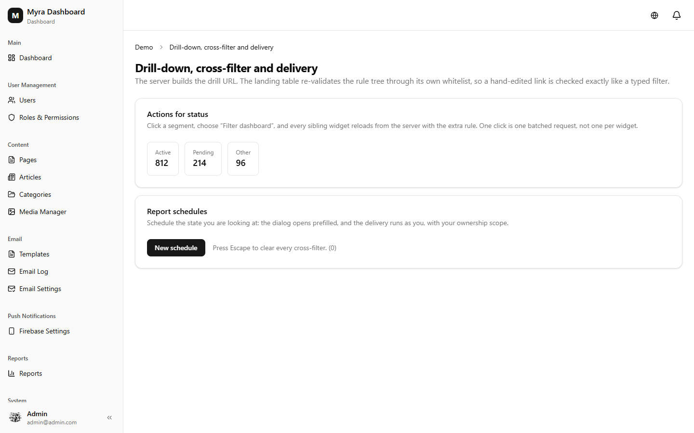

# Reporting, Charts & Delivery

Shipped in **v2.3.0**. Everything here aggregates in SQL — no code path pulls rows into PHP or the
browser to compute a total.



---

## Report definitions

A report declares a source, its dimensions, its measures and the filters it accepts. The runner
compiles that into a single `GROUP BY` query.

```php
use App\Admin\Report\{ReportDefinition, Dimension, Measure, Bucket, PeriodPreset};

ReportDefinition::make('users')
    ->model(User::class)
    ->titleKey('reports.users.title')
    ->dimensions([
        Dimension::make('status'),
        Dimension::make('created_at')
            ->allowedBuckets([Bucket::Day, Bucket::Week, Bucket::Month, Bucket::Quarter]),
    ])
    ->measures([
        Measure::count('signups'),
    ])
    ->periods([PeriodPreset::Last7Days, PeriodPreset::Last90Days]);
```

Key behaviours:

- **Bucket coarsening.** If the auto-granularity bucket is not in `allowedBuckets`, the request
  coarsens to the finest allowed bucket that still fits the group cap rather than erroring.
- **Group cap.** A request that would exceed `maxGroupCount` is refused with a 422 carrying
  `reports.errors.tooManyBuckets` — it never runs an unbounded aggregate.
- **Ownership.** A report aggregates only over records the acting user can see; scoping is applied
  before aggregation, not after.

## Charts

15 types. Chart.js backs bar/stacked/horizontal, line, area/stacked, pie, doughnut, radar, scatter
and polar; heatmap, funnel, gauge and sparkline render as inline SVG.

```ts
ChartWidget.make('signups')
    .type('stackedBar')
    .report('users')
    .compare('previous');   // comparison period: previous | year
```

Charts receive aggregated buckets only. A chart over ten million rows sends the same payload as one
over ten.

## Drill-down and cross-filtering

Clicking a chart segment opens the filtered table. The drill resolver derives the segment's calendar
range from its bucket key and ANDs the dimension rule onto the already-validated rule tree, so a
drill-through lands on a real `DataTable` with real filters — not a separate one-off view.

Cross-filtering lets one widget constrain the others on the same dashboard.

`DrillResolver` is resolved optionally:

```php
$resolver = app()->bound(DrillResolver::class) ? app(DrillResolver::class) : null;
```

With nothing bound, `row.drill` is `null` and the table simply does not offer a drill-through.

## Scheduled delivery and PDF



A schedule renders a report on a cron cadence and emails it using the existing email-template module.
PDF export is a hand-rolled streaming writer built on the same `RowWriter` interface as the XLSX
writer — **no new composer dependency**, and it streams rather than buffering.

Recipients are resolved per schedule and are ownership-scoped: a schedule cannot mail a report
containing rows its owner could not see.

---

## Related

- [Table Builder](table-builder.md) — the query builder and saved views a drill-through lands on
- [Dashboard & Realtime](dashboard.md) — where report widgets are placed
